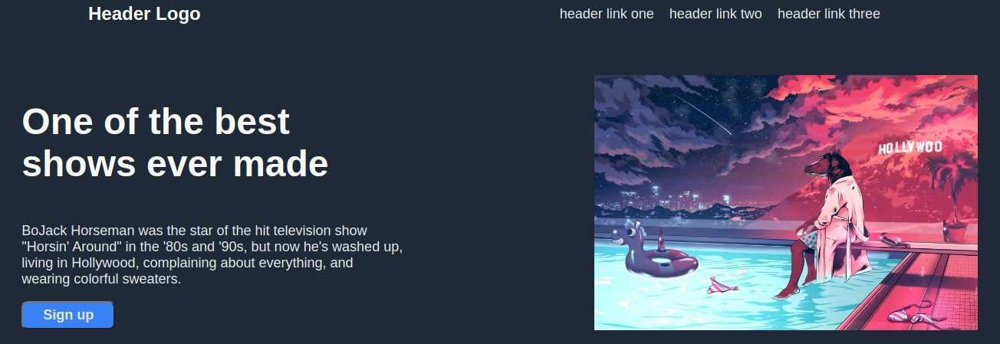

# Project-Landing-Page

Task:

For this project I’ll be creating an entire web page from a design provided by The Odin Project.

What I've learned?

HTML Foundations: Learned a fundamental building block of everything on the web.

CSS Foundations: Learned how to make my HTML look the way I want by adding styles with CSS.

FlexBox: Learned how to put things exactly where I want them on my web projects using flexbox.